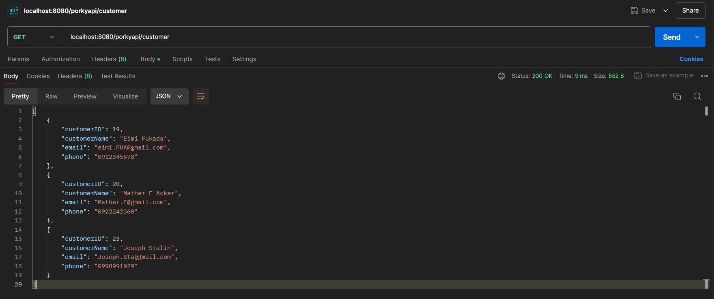

# CRUD API
## API For Database Management

This project involves creating an API for database connection and information management using Java Spring Boot and PostgreSQL. It includes data validation and some unit tests.

### Deployment GUI Only
https://porky-management.onrender.com/

### Json Data


`````
 Please Add JVM Like
 
-Dspring.config.location=D:\source\java\porkyapi\config\
-Dspring.config.name=config
-Dserver.port=8089


`````